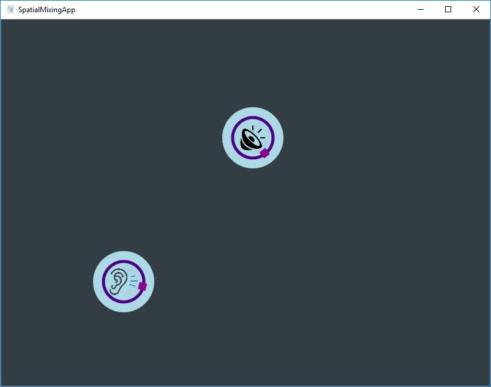

ABOUT
=====
Analog electronics have heavily shaped the way music is recorded and mixed, but with digital technology this no longer needs to be the case!
This app allows users to mix sounds by moving them around a virtual room instead of adjusting a multitude of knobs and faders.

TODO: 
-----
1. Implement distance framework
2. Research and implement audio principles

Status
------
Check out GUI Stage 1! Looks iffy, I know... Implements alternate look though to
facilitate future design changes.

The goal of this app is to eventually include effects to account for:
* Volume change by distance
* EQ change with distance
* Room EQ and Reverb
* Phase shift with distance
